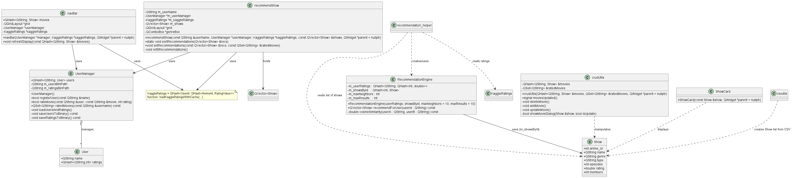

# Recommendation Algorithm

A Qt-based desktop application that recommends anime shows using collaborative filtering with cosine similarity algorithm. The application leverages Kaggle datasets containing anime information and user ratings to provide personalized recommendations.

## Project Overview

### What It Does
This application implements a **collaborative filtering recommendation system** using the **cosine similarity algorithm** to suggest anime shows based on user preferences. It reads data from two Kaggle CSV datasets:
- **Anime Dataset:** Contains information about anime shows (ID, name, genre, type, episodes, rating, members)
- **Ratings Dataset:** Contains user ratings for various anime shows

The system calculates similarity between users based on their rating patterns and identifies the most similar users to make recommendations for shows they haven't rated yet.

### Key Features
- **User Registration & Rating:** Register new users and rate anime shows
- **Personalized Recommendations:** Automatic recommendations based on cosine similarity with other users
- **CRUD Operations:** Add, update, and delete anime shows
- **Data Persistence:** User data and ratings are saved in binary format
- **Genre Filtering:** Filter recommendations by anime genre
- **Interactive UI:** Qt-based graphical interface for easy navigation

---

## Directory Structure

```bash
recommendation-algorithm/
├── CMakeLists.txt              # CMake build configuration
├── README.md                   
├── docs/                       # UML class diagram (PlantUML)
│   └── class_diagram.puml      
├── include/                    # Header files
│   ├── user.h                  # User data structure
│   ├── userManager.h           # User management and persistence
│   ├── ratingutils.h           # Rating utilities and Kaggle data loading
│   ├── components/
│   │   ├── navbar.h            # Navigation bar component
│   │   ├── showCard.h          # Show card display component
│   │   └── crudutils.h         # CRUD operations component
│   └── utils/
│       ├── csvutils.h          # CSV file parsing utilities
│       ├── show.h              # Show data structure
│       ├── recommendShow.h     # Recommendation display component
│       ├── recommendation_helper.h  # Recommendation algorithm orchestration
│       └── RecommendationEngine.h   # Core cosine similarity engine
├── src/                        # Source files
│   ├── resources.qrc           # Qt resources (images, icons, etc.)
│   ├── front/
│   │   ├── main.cpp            # Application entry point
│   │   ├── components/
│   │   │   ├── navbar.cpp
│   │   │   ├── showCard.cpp
│   │   │   ├── crudutils.cpp
│   │   │   └── recommendShow.cpp
│   │   ├── data/               # CSV data files
│   │   │   ├── anime.csv       # Anime shows dataset
│   │   │   └── rating.csv      # User ratings dataset
│   │   └── utils/
│   │       ├── csvutils.cpp
│   │       ├── show.h
│   │       ├── ratingutils.cpp
│   │       ├── userManager.cpp
│   │       ├── recommendation_helper.cpp
│   │       └── RecommendationEngine.cpp
└── build/                      # Build artifacts (generated by CMake)
```

---

## Architecture & UML Diagram



The architecture consists of three main layers:

1. **Data Layer:** `User`, `Show`, and database management through `UserManager`
2. **Algorithm Layer:** `RecommendationEngine` implementing cosine similarity
3. **UI Layer:** Qt components (`navBar`, `recommendShow`, `crudUtils`, `ShowCard`) for user interaction

---

## Recommendation Algorithm

### Cosine Similarity
The recommendation engine uses **cosine similarity** to find users with similar taste in anime:

1. **Vector Representation:** Each user is represented as a vector of ratings for anime shows they've rated
2. **Similarity Calculation:** Cosine similarity measures the angle between two user rating vectors
3. **Neighbor Finding:** The system identifies the k most similar users (default: 10)
4. **Recommendation Generation:** Shows rated by similar users that the target user hasn't rated are recommended, sorted by average rating from neighbors

**Formula:**
```bash
cosine_similarity(userA, userB) = (A · B) / (||A|| × ||B||)
```

Where:
- A and B are rating vectors
- A · B is the dot product
- ||A|| and ||B|| are the magnitudes of the vectors

### Data Flow
1. Load anime shows from `anime.csv`
2. Load user ratings from `rating.csv` (Kaggle dataset)
3. User registers or logs in
4. User rates anime shows
5. RecommendationEngine calculates cosine similarity with all users
6. Top K similar users are identified
7. Shows from top users that current user hasn't rated are recommended
8. Results are sorted by rating and returned

---

## Build Instructions

### Requirements
- CMake 3.16+
- C++17 compiler
  - **Windows:** Qt 6.x + MinGW (installed in `C:/Qt/6.x.x/mingw_64`)
  - **Linux:** Qt6 development packages (`qt6-base-dev`)
  - **macOS:** Qt 6.x via Homebrew (`brew install qt`)

---

## Build
```bash
git clone <repo>
cd recommendation-algorithm
mkdir build
cd build
cmake ..
cmake --build . --target deploy
```

---

## Run
```bash
./front        # Linux / macOS
./front.exe    # Windows
```

---

## Technologies Used

- **C++17:** Core programming language
- **Qt 6:** Cross-platform GUI framework
- **CMake:** Build system
- **Kaggle Datasets:** Anime and ratings data
- **Collaborative Filtering:** Recommendation algorithm approach
- **Cosine Similarity:** Mathematical basis for user similarity
